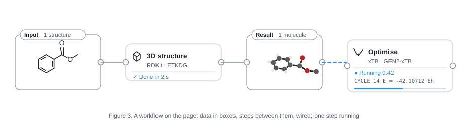
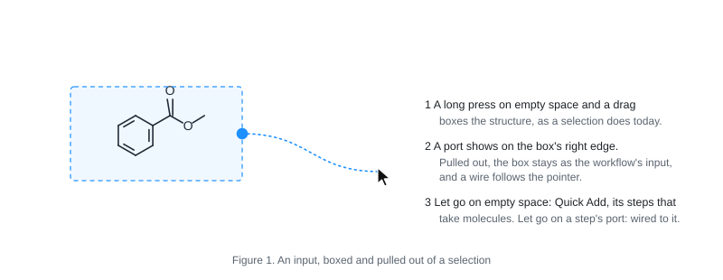
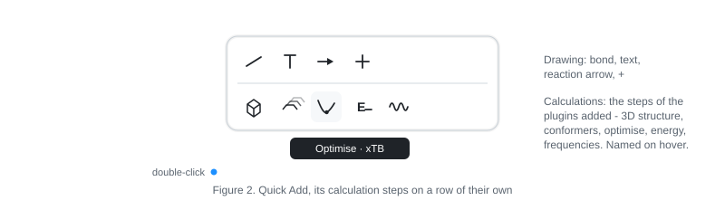
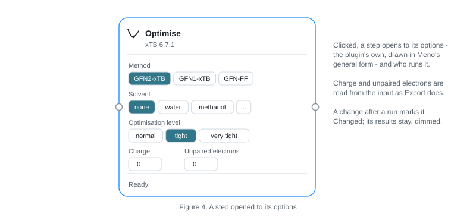
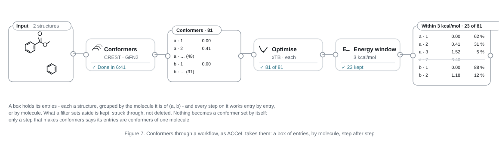
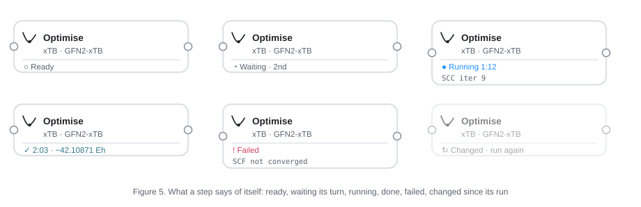
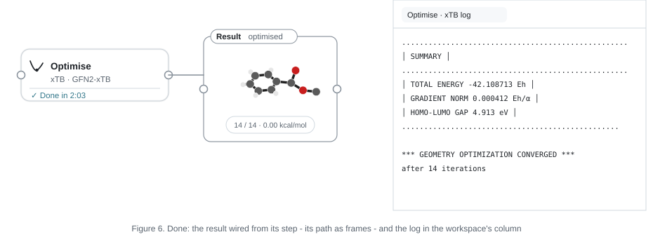

# Workflows on the page

A specification of stage 6 (WORKSPACE.md, *Stages*): calculations built as
workflows and run, on the page itself. Written on 2026-10-08 at the
maintainer's request - *a detailed UI specification before anything is
built* - and revised the same day with their answers. Nothing here is
built yet. Judge it against [PURPOSE.md](PURPOSE.md): a procedure that
combines several methods, expressed in a form the chemist can read,
rearrange and run again, with its results beside the molecule it is about.

## Decided by the maintainer (2026-10-08)

1. **The workspace is the node editor.** There is no editor of its own: a
   molecule drawn on the page, gathered into a set, is a workflow's input, and a
   calculation is a step added from Quick Add. *This is central to Meno's
   design from here on; it is specified in detail before it is built.*
2. **Meno is first a structure editor that is plain to use**; what more
   it does is reached as the chemist goes further. So Quick Add has **one
   button** for calculations, which opens to them; the drawing's four
   stay as they are.
3. **Meno defines the kinds of step; plugins fill them.** Plugins are to
   be fetched over the internet and made by anyone, and Meno cannot know
   all a plugin does. Only **plugins added** are shown: a step no plugin
   added fills is not offered.
4. **A set of conformers goes through a workflow as any set does**: a
   set of entries, each a structure, worked through step after step.
   (ACCeL, the maintainer's own library, was named only as an example
   that conformer sets can flow so; Meno takes nothing else from it - see
   15.) **A set is a conformer set only where the flow shows that it is
   one**; made by the chemist, it is a compound set (*Compound sets and
   conformer sets*, below).
5. **What lies inside a set's frame is what it holds**: a structure moved
   into it joins it, one moved out leaves it.
6. **xTB first.** Programs installed separately - ORCA, Gaussian and
   others - are to be run later, through the same kinds of step.
7. **This computer only**, for now. A cluster or a remote machine comes
   later, in a stage of its own; nothing here shuts it out.
8. **A calculation running when Meno closes goes on.** Opened again, the
   workspace picks it up.
9. **The proposals are kept** for: making an input from the selection's
   port; results in a set to the right of their step; menus, not keys, to run;
   2D made 3D by a step of its own; jobs' files in Meno's data folder.
10. **The Workflow Builder tab goes, and ReactFlow with it.** The
    workspace's editor is built anew: neither the tab nor ReactFlow's
    code is looked at (*Licences*).
11. **A step on many entries runs a job for each**, by default; a plugin
    may say that its program takes them all in one job, where it does
    that better (*Several at once*).
12. **Meno does the simple steps itself, a plugin may do them instead**,
    the chemist choosing which - as *Files* chooses who reads a kind of
    file (FILE-IO.md). ACCeL's second version is under way, outside this
    repository: it may come later as a plugin that fills these steps.
    RDKit can fill *Duplicates*, if less thoroughly than ACCeL (*Who
    does a step*).
13. **A conformer set is converted to only on purpose**: what the chemist
    gathers into a set is a compound set; a step of its own, *As
    conformers*, makes it a conformer set, on the page for the flow to
    show.
14. **Meno's own words, and its own design** (the maintainer, 2026-10-08):
    what holds a workflow's entries is not called a *box* - ACCeL's
    word for its own class (its second version calls it a *Flow*) - but
    a **set**; and the implementation and the interface are what suit
    Meno best, not ACCeL's.
15. **The figures here are conceptual** (the maintainer, 2026-10-08): they
    show what is where, not how it looks. The look follows Meno's own
    design (*How it looks*); the figures' colours, transparency, line
    widths and icons are not to be taken from them.

No question is left open; the whole is for the maintainer to read and
agree before step 1 is built.

## Words

- **Workflow** - what is wired together on one page: sets and the steps
  between them.
- **Set** - a frame on the page, and what lies inside it. An *input* set
  is made by the chemist round what is there; a *result* set is made by
  a step, round what it gave.
- **Entry** - one structure in a set: a drawing, or a molecule in 3D,
  with what has been found of it (its energy, its population...), and in
  play or set aside.
- **Compound set** - a set whose entries are each a compound of its own:
  what a set the chemist makes holds.
- **Conformer set** - a set whose entries are conformers, grouped by the
  compound each is of (*a*, *b*...): what the flow makes, and only it.
- **Step** - one kind of calculation done to a set's entries, of a kind
  Meno defines (*Kinds of step*), filled by a plugin or by Meno.
- **Port** - where a wire starts or ends: a set gives from its right
  edge; a step takes on its left edge and gives on its right; a result
  set takes on its left edge.
- **Wire** - a line from a port that gives to a port that takes.
- **Run** - one time a step was carried out, and what it gave; a step
  keeps its runs.
- **Job** - a program running for a run, on this computer, in a folder
  of its own, its log written as it goes.
- **Procedure** - a chain of steps without their data, saved to be put
  down again.

## What is on the page

A workflow lives among everything else on the page - drawings, molecules
in 3D, arrows, text - and is made of three things:

- **Sets.** A thin rounded frame, with its name on a tab at its top left
  - *Input*, or what a step made (*Conformers*, *Optimised*) - and how
  many entries it holds (*1 structure*, *81 conformers*, *23 of 81*). It
  gives from a port on its right edge, half-way down; a result set takes
  on its left edge too.
- **Steps.** A small card: an icon and what the step does (*Optimise*);
  below it, who does it and how (*xTB · GFN2-xTB*); a rule; and what it is
  doing (*Ready*, *Running 0:42*). It takes on its left edge and gives on
  its right.
- **Wires.** Curves from port to port, leaving and arriving level; while
  a step runs, the wire into it moves (a slow dash),
  and goes still when it is done.

They are page items, as an arrow or a molecule in 3D is: they lie on the
page, at the page's scale, zoom and pan with it, and are saved with it. A
step's words stay legible as it zooms: where they would be smaller than 9
px on the screen, the card shows its icon and its state's icon alone.

### How it looks

As Meno's own things look (decided: 15), not as the figures here do:

- **Colours** from Meno's palette only: its greys for frames, lines and
  words; the accent (`accel-base`) for what is done or chosen; the
  attention colour (`accel-accent`) for what failed; the canvas's own
  hover blue for what is under the pointer on the canvas, as an atom or
  an arrow is lit.
- **Lines** as fine as Meno's cards' and chips' borders - a hair on the
  screen, at any zoom - and wires no heavier than they.
- **Cards** as Meno's chips and cards are: white, rounded, a hairline
  border, a soft shadow; words in the sizes Meno's chips use.
- **No tints or fading** to say what state a thing is in: its words and
  its icon say it. A part fades in and out only as it comes and goes.
- **Icons** in the style of the icons Meno already uses (Heroicons'
  outline), from that set where one fits.

Everything comes and goes as Meno's things do (theme/motion): a set, a
step and a wire fade in where they are put; a state changes its words
and colour in a short ease; nothing jumps. Moved, they move as the
pointer does; put back by an undo, they glide back.

## Making a workflow

### An input: a set from the selection

1. **Select the molecules** with the gesture that selects today: a long
   press on empty space and a drag (or Ctrl/⌘ and a drag).
2. **A port shows on the selection's right edge** while it holds whole
   structures or molecules in 3D (a few atoms of a structure make no
   input). It fades in once the selection is made; nothing else of the
   selection changes, and a chemist who never pulls it never meets a
   workflow.
3. **Pull a wire out of the port.** The selection's frame stays, as an
   *Input* set; a wire follows the pointer.
   - Let go on empty space: Quick Add opens there, at the kinds of step
     that take what the set gives. A step chosen is put down there, wired.
   - Let go on a step's port: wired to it.
   - Let go where nothing takes it, or Escape: the wire goes, and the set
     stays.
4. **Or from the menu**: right-click the selection, *Use as input*.

**What a set holds is what lies inside its frame** (decided):

- a structure or a molecule in 3D whose middle is inside the frame is in
  the set; dragged in, it joins; dragged out, it leaves;
- the frame is the set's own: its tab drags it, with all it holds; its
  edges and corners drag to size it;
- drawn on, a structure stays in it, and the frame grows to keep it
  inside if it would reach past it;
- *Delete set* (right-click its tab) takes the frame away and leaves what
  it held; a set left empty stays, empty, until it is deleted.

A set's entries are its structures and molecules in 3D, in the order they
lie (top to bottom, left to right). A set the chemist makes is a
**compound set**: each entry a compound of its own, however alike two
are (*Compound sets and conformer sets*).

### Kinds of step

Meno defines the kinds of step - what each takes, what it gives, and how
it is shown - so that steps join whoever fills them; plugins fill them,
each with its own options. A plugin cannot bring a kind of its own; a
new kind comes with Meno, as a new role does (PLUGINS.md, *Roles*).

| Kind | Icon (Heroicons' outline) | Takes | Gives |
| --- | --- | --- | --- |
| 3D structure | a cube | structures | molecules in 3D - the same kind of set |
| Conformers | a stack of layers | molecules in 3D | **a conformer set**: each compound's conformers |
| Optimise | a trend going down | molecules in 3D | each optimised, its path as frames - the same kind of set |
| Energy | a bolt | molecules in 3D | each with its energy - the same kind of set |
| Frequencies | a signal | molecules in 3D | each with its vibrations and thermal corrections - the same kind of set |
| Energy window | a funnel | a conformer set, with energies | those within the window of their compound's lowest; the rest set aside |
| Duplicates | two squares, one over the other | molecules in 3D | each unlike the others of its compound kept; the rest set aside - the same kind of set |
| Populations | bars | a conformer set, with energies | each with its Boltzmann population within its compound |
| As conformers | shapes grouped | a compound set of molecules in 3D | **a conformer set**: entries of the same constitution - the same atoms, bonded the same way - as conformers of one compound |

The first five run a program; the last four work on a set's entries
alone (*Who does a step*). A step that keeps a set keeps its kind: a
conformer set optimised is still one. More kinds come with Meno as they
are needed - a free energy from an energy and its corrections, the
lowest of each compound, a template input written out - each specified
before it is built.

### Who does a step

As *Files* chooses who reads each kind of file (FILE-IO.md, decided
again for steps on 2026-10-08):

- **Meno does the simple steps itself** - *Energy window*,
  *Populations*, *As conformers*, and *Duplicates* in a plain way (the
  RMSD of the entries' atoms in their own order, after the best fit; it
  does not see symmetric atoms swapped, so two copies of a structure
  numbered differently can both be kept). Meno's part is there from the
  start, with nothing to add.
- **A plugin added may do any of them instead**: RDKit does *Duplicates*
  with its best RMSD over the molecule's symmetries; ACCeL, its second
  version, may come as a plugin that does them all as ACCeL does.
- **The chemist chooses**, in Settings, *Calculations* - a table like
  *Files*: each kind of step, who does it (*Meno*, or a plugin added),
  and its options' defaults - and in the step itself, which says who
  does it on its card (*Duplicates · Meno*, *Duplicates · RDKit*).
- **Steps that run a program** are done by plugins only: Meno runs no
  program of its own.

### A step: from Quick Add

- **Quick Add keeps its four** - bond, text, reaction arrow, "+" - and
  gains **one button**: *Calculations*, a small graph of two joined
  sets, after a thin rule.
- **Pressed, it opens** a panel below the row, of the kinds of step,
  each an icon, named on hover with who does it (*Optimise · xTB*):
  first those that run a program, then those that work on entries.
  *As conformers* is not among them: it is reached from a compound set's
  port, its wire let go on empty space, at the end of the panel - a
  conversion taken on purpose.
- **Only what something added does is there.** With no plugin that runs
  a program added, the panel shows the steps Meno does itself; a kind
  nothing does is not shown, and nothing is shown of plugins not added.
- **A wire let go on empty space** opens Quick Add already at
  *Calculations*, showing only the kinds that take what the wire
  carries.
- **Who does a kind** where more than one can is chosen in the step
  (*Its options*); Settings, *Calculations*, says who by default (*Who
  does a step*).

### Wires

- **Drawn** from a port that gives to one that takes, or the other way: a
  press on a port and a drag. While it is drawn, the ports that would
  take it are lit in the accent; the others stay as they are.
- **What may join**: what a port gives to a port that takes it (*Kinds of
  step*). Nothing is converted on the way: a set of structures does not
  go into *Optimise* - a *3D structure* step goes between, on the page;
  a compound set does not go into *Populations* - *As conformers* goes
  between, or a *Conformers* step.
- **One port may feed several steps**; a port that takes, one wire. A
  wire drawn to a port that has one replaces it.
- **Deleted** by Delete or Backspace with the pointer on it, or its menu;
  dragging its end off a port and letting go on nothing deletes it too.

### Its options

A click on a step opens it, in place, to its options - as a molecule's
frames chip opens to its slider:

- the plugin's own options, drawn in Meno's general form (`lib/options`,
  as Export draws a writer's): for xTB, its method (GFN2-xTB, GFN1-xTB,
  GFN-FF), solvent, optimisation level; for *Energy window*, the window
  (3 kcal/mol);
- the charge and the unpaired electrons, read from each entry as Export
  reads them, and changeable;
- who does it, where more than one can (*Who does a step*);
- *Show log* and *Show files* once it has run.

Another click on its title, Escape, or a press elsewhere closes it. The
last options chosen for each kind are what a new step starts with.

## Compound sets and conformer sets

Conformers go through a workflow as any set does (decided):

- **A set holds entries**, each a structure, with what has been found of
  it: energies, corrections, populations.
- **A set is one of two kinds** (decided):
  - a **compound set** - each entry a compound of its own. What the
    chemist gathers into a set is one, always: two structures in a set
    together are two compounds, however alike; a file of many geometries
    read and gathered into a set
    is a compound set of many, not conformers because there are many;
  - a **conformer set** - entries grouped by the compound each is a
    conformer of (*a*, *b*...). It is made
    by the flow only: by *Conformers*, or by *As conformers* - the
    conversion taken on purpose, a step on the page like any other - and
    kept by the steps after them that keep their set's kind. So whether
    a set is a conformer set can always be read from the flow that led
    to it.
- **Steps work entry by entry**, or compound by compound where the kind
  says so: *Optimise* each entry; *Energy window* and *Populations*
  within each compound of a conformer set.
- **What a step sets aside is kept**, struck through in its set, not
  deleted, so that a window made
  wider brings it back on the next run.
- **On the page**, a conformer set's compound is shown as one molecule in
  3D with its conformers as frames - the conformer set Meno draws today,
  its chip saying the entry, its energy and population; entries set aside
  are not among its frames, and are listed, struck through, in its set.
  A compound set's entries are separate molecules, each its own.
- **A set's tab says which it is**: *Compounds · 2*, *Conformers · 2
  compounds · 81*.

## Running

### Starting and stopping

| From | What |
| --- | --- |
| A step's menu (right-click) | *Run* - this step, and first any step before it that has not run or has changed |
| | *Run from here* - this step and every step after it |
| | *Stop* - while it is waiting or running |
| | *Show log*, *Show files*, *Options…*, *Delete step* |
| Meno's menu | *Run all* - every step on the page that has not run or has changed, in order |
| | *Stop all* |

No key starts a run (decided: menus, at first). Steps run in the order
their wires give; steps that do not depend on one another may run at
once (*Several at once*).

### States

| State | Icon and colour | What the card says |
| --- | --- | --- |
| Ready | none, grey words | *Ready* |
| Waiting | a clock, grey | *Waiting · 2nd* - its place in the queue |
| Running | turning, the accent | *Running 1:12*, or *Running · 7 of 81*; the log's last line under it; a thin bar where the program says how far it is |
| Done | a tick, the accent | *2:03 · −42.10871 Eh*, or *81 of 81*, or *23 kept* - how long, and the number the step is for |
| Failed | an exclamation mark, the attention colour | *Failed* - and the line of the log that says why; *3 of 81 failed* where some entries did |
| Stopped | a stop, grey | *Stopped after 0:31* |
| Changed | turning arrows, grey | *Changed · run again* - its options, or what comes into it, changed since its run; its results stay as they are |

### The log

*Show log* opens the job's log in the workspace's column of texts (PR
#172), updating while the job runs - its last lines kept in view unless
the chemist scrolled up. A step of many entries has a log for each,
named for the entry. A log is a text of the workspace like any other.

### Results

When a run is done, what it gave comes in as a result set to the right
of the step, wired from it (decided):

- **Optimise**: each entry as optimised, its path as frames, the energy
  of each frame - what an optimisation read from a file shows today;
- **Conformers**: a conformer set - each compound's conformers, as its
  entries (*Compound sets and conformer sets*);
- **Energy**, **Frequencies**: the entries, each with its energy, or its
  vibrations and thermal corrections;
- **Energy window**, **Duplicates**, **Populations**: the same entries,
  some set aside, or with their populations;
- **As conformers**: the same entries, as a conformer set.

They are calculation results as Meno knows them: the frames chip,
pointing at atoms, the lists. The set's port feeds the next step.

Run again, a step replaces its result set's entries with the new run's,
gliding to where they now are; earlier runs are kept in the step (*Runs*,
under its options: when, with what options, how long, the number it
gave), and one can be shown again.

### Several at once

- By default **one job runs at a time** on this computer; others wait,
  in the order they were started. Settings, *Calculations*: how many at
  once, and how many cores each may use.
- **A step on many entries makes one job for each** (decided), queued as
  above - each with its own log, a failure its own, several at once
  where Settings allows.
- **Unless its plugin says otherwise**: a plugin's manifest may say that
  a kind it fills takes all its entries in one job, where its program
  does that better - CREST optimising an ensemble in one run
  (`crest --mdopt`), ORCA chaining jobs in one input. Then the step runs
  one job, with one log, and the entries that came out of it are told
  apart in the results; a failure is the whole job's.

### When Meno closes

- **Jobs go on** (decided). Closing with jobs waiting or running says how
  many will go on, and asks nothing else; those waiting start in turn,
  without Meno.
- **Opened again**, a workspace looks at its jobs: done - their results
  come in, as if Meno had been open; still running - shown running, with
  the time since they started; gone without finishing (the computer was
  restarted, say) - *Stopped*, with their logs.
- A workspace never saved keeps its jobs with the unsaved workspace Meno
  reopens; closed without saving, its jobs are stopped - said in the
  dialog that asks about saving.

### Undo

- Making a workflow is editing the page: a set, a step, a wire, options -
  each an undo step, as anything drawn.
- A run is not undone. Its results coming in is one step: an undo takes
  them away (the step shows its earlier run, or none), a redo brings them
  back. The job's files stay until the step is deleted.
- Deleting a step that is running asks first; it stops it.

## Saving and sharing

- **The workspace keeps it all** (`.meno`, FILE-IO.md, *The workspace
  file*): sets, steps, wires, options; each run - when, with what
  options, which program and version, how it ended; logs and outputs, as
  files kept by their SHA-256; results as entries on the page.
- **Shared, a workspace is the procedure with its results**: opened
  elsewhere, everything is there to read, and runs again where the same
  plugins are added.
- **A procedure** - steps without their data - is made from a selection
  of steps: right-click, *Save as procedure…*, named. Procedures are
  listed in Quick Add's *Calculations* after the kinds, one icon each;
  put down, the chain comes, wired, ready for an input. Shared as a file
  of their own (later in order).

## Programs and plugins

- **xTB**: a plugin whose environment is made by pixi from conda-forge -
  xtb 6.7.1, LGPL-3.0, for macOS (Apple silicon and Intel), Windows and
  Linux. It fills *Optimise*, *Energy* and *Frequencies*, and reads its
  own outputs back.
- **CREST**: *Conformers*, by a plugin made the same way - crest 3.0.2,
  LGPL-3.0, on conda-forge for macOS and Linux only. On Windows it cannot
  be added, and *Conformers* is filled by RDKit alone there.
- **Programs installed separately** (ORCA, Gaussian): never fetched by
  Meno - their licences do not allow it. A plugin's manifest says which
  program it needs and how to know it (its name, and the line its version
  is read from); Meno looks for it where the system finds programs, and
  Settings, *Plugins*, shows where - or *Not found - Locate…*. A step
  whose program is not found says so on its card, and its *Run* opens
  that place.

### What changes in the contract

- **The manifest says which kinds of step a plugin fills** (`steps`): for
  each, the kind (one of Meno's), its options in the general form, the
  programs it needs, and whether it takes all its entries in one job.
  Meno shows a kind only where something added fills it.
- **Two new requests** (PLUGINS.md, *The contract*):
  - `prepare {step, entries, options}` - each job's files and the command
    that runs it;
  - `collect {step, files}` - what a job gave, read from its files, in
    Meno's own forms.
- **Meno runs the jobs, not the plugin**: its own executable in a job
  mode, started apart from Meno so that it outlives it, runs the command
  in the job's folder - in the plugin's environment, or with the program
  found - writes the log, and records how it ended. Every job is
  started, stopped and logged the same way, whoever prepared it; *Stop*
  stops the program and everything it started (a process group on macOS
  and Linux, a job object on Windows).
- **Steps on entries alone** (*Energy window*...), done by a plugin
  rather than by Meno, are a plain request, `run {step, entries,
  options}`, answered at once, no job made.
- **Jobs reach no network**, as the plugins' workers do not.
- **A job's folder** is in Meno's data folder (`jobs/<id>/`; decided):
  its input, its log, its outputs, Meno's record of it. *Show files*
  opens it. Its outputs are kept in the workspace when they come in; the
  folder goes when its step is deleted, or by *Settings, Calculations,
  Clear finished jobs' files*.

## Licences

- **The editor is Meno's own.** Sets, steps, wires, ports and their
  drawing on the page are written for Meno, from this specification,
  with no code taken or read from ReactFlow, the Workflow Builder tab, or
  any other node editor (the maintainer, 2026-10-08). ReactFlow
  (`@xyflow/react`) leaves Meno's dependencies with the tab.
- **Programs are run, not linked**: xTB and CREST (LGPL-3.0) are
  separate programs in their plugins' environments, fetched from
  conda-forge with the chemist's consent; their licences are shown in
  Settings, *Plugins*, as each plugin's is.
- **Programs installed separately** are found, never fetched or shipped.
- **ACCeL** (MIT), if its second version comes as a plugin, is fetched
  like any other, its notice shown with it. Meno's own steps on entries
  are written for Meno from this specification and published methods;
  ACCeL's code is not copied into Meno (were it ever, its MIT notice
  would go with it - Meno is Apache-2.0).
- **Figures and icons** here and in the app are Meno's own.

## Where this leaves what is there

- **The Workflow Builder tab** and ReactFlow go (decided), once sets and
  steps are on the page - or before; nothing here uses them.
- **Export** keeps writing a calculation's input (Gaussian's, through
  its plugin) for a chemist who runs it elsewhere.
- **Opening an output** keeps working as now; an output read is a
  molecule like any other, and can be put in a set.
- **RDKit's conformers** (*3D structures*) stay as they are; in a
  workflow, RDKit fills *3D structure* and *Conformers*.

## In order

1. **Sets, steps and wires on the page**, none run: the document's new
   items, their drawing, inputs made from the selection, wires, Quick Add's
   *Calculations*, menus, undo, saving; Meno's own *As conformers*,
   *Energy window*, *Duplicates* and *Populations* - the first steps that
   do something, on entries read from files - and Settings,
   *Calculations*, choosing who does each. The Workflow Builder tab and
   ReactFlow removed.
2. **The job runner**: Meno's job mode, started apart; logs; *Stop*;
   picking jobs up when a workspace is opened; Settings, *Calculations*.
3. **xTB**: its plugin; *Optimise*, *Energy*, *Frequencies*; results
   coming in. The first workflow that runs: input → 3D structure →
   optimise.
4. **Chains**: running in order, *Run from here*, *Run all*, *Changed*,
   runs kept, several at once.
5. **Conformers**: RDKit's in a step, and RDKit's *Duplicates*; then
   CREST (macOS and Linux).
6. **Programs installed separately**: ORCA and Gaussian - finding them,
   their steps, reading their outputs.
7. **Procedures**: saved, put down again, shared as a file.

Each is a PR of its own, checked on the Mac; Windows is asked only where
something is Windows' own (the job object; xTB's Windows build).

## Questions

None left open (2026-10-08). The specification as a whole is for the
maintainer to read and agree before step 1 is built; what they change
is folded in here first.
