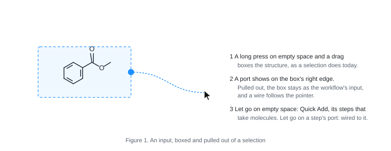

# Workflows on the page

A specification of stage 6 (WORKSPACE.md, *Stages*): calculations built as
workflows and run, on the page itself. Written on 2026-10-08 at the
maintainer's request - *a detailed UI specification before anything is
built* - for the maintainer to read, change and agree. Nothing here is
built yet. Judge it against [PURPOSE.md](PURPOSE.md): a procedure that
combines several methods, expressed in a form the chemist can read,
rearrange and run again, with its results beside the molecule it is about.

## Decided by the maintainer (2026-10-08)

1. **The workspace is the node editor.** There is no editor of its own: a
   molecule drawn on the page, boxed, is a workflow's input, and a
   calculation is a step added from Quick Add. *This is central to Meno's
   design from here on; it is specified in detail before it is built.*
2. **xTB first.** Programs installed separately - ORCA, Gaussian and
   others - are to be run later, through the same steps.
3. **This computer only**, for now. A cluster or a remote machine comes
   later, in a stage of its own; nothing here shuts it out.
4. **A calculation running when Meno closes goes on.** Opened again, the
   workspace picks it up: its results come in if it has finished, and it
   shows as running if it has not.

## Words

- **Workflow** - what is wired together on one page: boxes of molecules
  and the steps between them.
- **Box** - a frame round molecules on the page. An *input* box is drawn
  by the chemist round what is already there; a *result* box is made by a
  step, round what it gave.
- **Step** - one calculation done to the molecules wired into it: make
  them 3D, search their conformers, optimise, an energy, frequencies. A
  step is filled by a plugin (PLUGINS.md), as a role is.
- **Port** - where a wire starts or ends: on a box's right edge (what it
  holds, out), on a result box's left edge and a step's left edge (in),
  on a step's right edge (out).
- **Wire** - a line from a port that gives to a port that takes.
- **Run** - one time a step was carried out, and what it gave; a step
  keeps its runs.
- **Job** - a run under way: a program running on this computer, in a
  folder of its own, its log written as it goes.
- **Procedure** - a chain of steps without their data, saved to be put
  down again on other molecules.

## What is on the page

A workflow lives among everything else on the page - drawings, molecules
in 3D, arrows, text - and is made of three things:

- **Boxes** round molecules. A box is a thin rounded frame a little
  outside what it holds, with its name on a tab at its top left: *Input*,
  or the step's result (*Optimised*, *Conformers*) - and how many it holds
  (*1 structure*, *12 molecules*). Its port out is on its right edge,
  half-way down. A result box has its port in on its left edge too.
- **Steps** - small cards: an icon and what the step does (*Optimise*);
  below it, who does it and how (*xTB · GFN2-xTB*); a rule; and what it
  is doing (*Ready*, *Running 0:42*). Its port in is on its left edge, its
  port out on its right.
- **Wires** - curves from port to port, leaving and arriving level, in the
  frames' grey; while a step runs, the wire into it moves (a slow dash),
  and goes still when it is done.

They are page items, as an arrow or a molecule in 3D is: they lie on the
page, at the page's scale, zoom and pan with it, and are saved with it.
A step's text stays legible as it zooms: where it would be smaller than 9
px on the screen, the card shows its icon and its state's mark alone.

### How each looks (visual specification)

| Part | Look |
| --- | --- |
| Box | 1.2 px line, `#8c959f`, radius 10 px at 100 %; no fill. Its tab: white, the same line, radius 10 px; the name in 11.5 px semibold, the count in grey. 12 px clear of what it holds. |
| Box, under the pointer | lit from behind in the highlight's blue at 7 %, as anything under the pointer is (EDITOR-2D.md, *Hover, then act*) |
| Box, selected | its line in the highlight's blue |
| Step | white card, 1 px `gh-line`, radius 12 px, the soft shadow the frames chip has; 190 to 250 px wide at 100 %; title 13.5 px semibold, who and how 11.5 px grey, state 11.5 px in the state's colour (*States*), the log's last line 10.5 px monospaced |
| Port | 11 px circle, white, 1.6 px line in the frames' grey; filled with the highlight's blue while a wire is being drawn from it, and on the ports that would take it |
| Wire | 1.6 px, the frames' grey; running: the highlight's blue, a dash moving along it at about 20 px a second; failed: the attention colour |

Everything comes and goes as Meno's things do (theme/motion): a box, a
step and a wire fade in where they are put; a step's state changes its
words and colour in a short ease; nothing jumps. Moved, they move as the
pointer does; put back by an undo, they glide back.

## Making a workflow

### An input: boxing molecules

1. **Box the molecules** with the gesture that selects them today: a long
   press on empty space and a drag (or Ctrl/⌘ and a drag). Structures and
   molecules in 3D that the box takes in whole are selected, as now.
2. **A port shows on the selection's right edge** while what it holds is
   whole structures or molecules in 3D (a few atoms of a structure do not
   make an input). It fades in after the box is drawn; nothing else of
   the selection changes.
3. **Pull a wire out of the port.** The selection's box stays, as an
   *Input* box round what it held; a wire follows the pointer.
   - Let go on empty space: Quick Add opens there, showing only the steps
     that take what the box gives (*Quick Add*, below). A step chosen is
     put down there, wired.
   - Let go on a step's port in: wired to it.
   - Let go where nothing takes it, or press Escape: the wire goes, and
     the box stays.
4. **Or from the menu**: right-click the selection, *Box as input*.

What a box holds is what it held when it was made: the structures (by
their atoms) and the molecules in 3D. It follows them:

- drawn on, a structure in a box stays in it - a bond added, a ring
  closed - and the box grows round it;
- moved with the box: dragging the box's tab moves the box and all it
  holds; dragging one of its molecules moves that molecule, and the box
  grows or shrinks round where it is now;
- *Take out of the box* (right-click a molecule in a box) and *Put in the
  box* (right-click a structure, then the box) change what it holds;
- deleted: a box goes with the last molecule it held; *Delete box*
  (right-click its tab) leaves the molecules where they are.

A box of 2D structures gives structures; one of molecules in 3D gives
molecules in 3D. A step that needs 3D takes 2D structures only by way of
a *3D structure* step (RDKit, as *3D structures* makes them today), shown
on the page like any other: the chemist can see, and change, how the
geometry was made.

### A step: from Quick Add

Quick Add (EDITOR-2D.md, *Quick Add*) gains a second row, its
**calculation steps**, below the drawing's - once a plugin that offers
steps is added. Each is an icon, named as the pointer rests on it, with
who fills it: *Optimise · xTB*.

| Icon | Step | Takes | Gives |
| --- | --- | --- | --- |
| a cube | 3D structure | structures | molecules in 3D |
| three rings, stacked | Conformers | molecules in 3D | a conformer set |
| a curve to its lowest point | Optimise | molecules in 3D | molecules in 3D, their paths as frames |
| E and a level | Energy | molecules in 3D | the same, with their energies |
| a wave | Frequencies | molecules in 3D | the same, with their vibrations |

- **A double-click on empty space** opens Quick Add as now; a step chosen
  is put down there, unwired.
- **A wire let go on empty space** opens Quick Add with its calculation
  row alone, and only the steps that take what the wire carries.
- **Steps of plugins not added**, where a plugin on offer fills them, are
  shown dimmed, and named *Optimise · xTB - add it in Settings, Plugins*;
  chosen, they open that place (PLUGINS.md, decision 8).
- **Who fills a step** where more than one plugin can is chosen in the
  step (*Its options*); Settings, *Molecules in 3D*, says who by default,
  as it does for conformers today.

### Wires

- **Drawn** from a port out to a port in, or the other way: a press on a
  port and a drag. While it is drawn, the ports that would take it are
  lit; the others are dimmed.
- **What may join**: a port out to a port in that takes what it gives
  (the table above). A conformer set goes into a step that takes
  molecules in 3D as many molecules: each is calculated (*Running*,
  below).
- **One port out may feed several steps**; a port in takes one wire. A
  wire drawn to a port in that has one replaces it.
- **Deleted** by Delete or Backspace with the pointer on it, or its menu;
  dragging its end off a port and letting go on nothing deletes it too.
- A wire is drawn from where its ports are, so it follows a box or a step
  that is moved.

### Its options

A click on a step opens it, in place, to its options - as a molecule's
frames chip opens to its slider:

- the plugin's own options, drawn in Meno's general form (`lib/options`,
  as Export draws a writer's): for xTB, its method (GFN2-xTB, GFN1-xTB,
  GFN-FF), solvent, optimisation level;
- the charge and the unpaired electrons, read from the input as Export
  reads them, and changeable;
- who fills it, where more than one plugin can;
- *Show log* and *Show files* once it has run.

Another click on its title, Escape, or a press elsewhere closes it. The
last options chosen for each step are what a new one starts with
(remembered as Export's are).

## Running

### Starting and stopping

| From | What |
| --- | --- |
| A step's menu (right-click) | *Run* - this step, and first any step before it that has not run or has changed |
| | *Run from here* - this step and every step after it |
| | *Stop* - while it is waiting or running |
| | *Show log*, *Show files*, *Options…*, *Delete step* |
| Meno's menu | *Run all* - every step on the page that has not run or has changed, in order |
| | *Stop all* |

No key starts a run at first (EDITOR-2D.md: keys are kept to what is used
most). Steps run in the order their wires give; steps that do not depend
on one another may run at once (*Several at once*).

### States

What a step says of itself, on its card's last line, in words and a mark
before them:

| State | Mark and colour | What the card says |
| --- | --- | --- |
| Ready | ○ grey | *Ready* |
| Waiting | ◔ grey | *Waiting · 2nd* - its place in the queue |
| Running | ● the highlight's blue | *Running 1:12*, the log's last line under it, and a thin bar where the program says how far it is (an optimisation's cycles do not; a conformer search's may) |
| Done | ✓ the accent | *2:03 · −42.10871 Eh* - how long it took, and the number the step is for |
| Failed | ! the attention colour | *Failed* - and the line of the log that says why |
| Stopped | ■ grey | *Stopped after 0:31* |
| Changed | ↻ grey, the card dimmed | *Changed · run again* - its options, or what comes into it, changed since its run; its results stay, dimmed |

A step with many molecules coming in says how many are done: *Running ·
7 of 12*.

### The log

*Show log* opens the job's log in the workspace's column of texts (PR
#172), updating while the job runs - the last lines kept in view, unless
the chemist scrolled up. It is a text of the workspace like any other:
kept, closed, written to a file with Export.

### Results

When a run is done, what it gave comes in as molecules in 3D, in a
result box to the right of the step, wired from it:

- **Optimise**: each molecule as optimised, its path as frames, the
  energy of each frame - what an optimisation read from a file shows
  today (WORKSPACE.md, *Stage 3, as built*);
- **Conformers**: one molecule, its conformers as frames with their
  energies and populations - a conformer set, as RDKit's today;
- **Energy**: the molecules, each with its energy;
- **Frequencies**: the molecules, each with its vibrations' list.

The results are calculation results as Meno knows them: the frames chip,
pointing at atoms, the lists. The box's port out feeds the next step.

Run again, a step replaces its result box's molecules with the new run's,
the molecules gliding to where they now are; the earlier runs are kept in
the step (*Runs*, under its options: when, with what options, how long,
the number it gave), and one of them can be shown again.

### Several at once

- By default **one job runs at a time** on this computer; others wait,
  in the order they were started. Settings, *Calculations*: how many at
  once (1 to the number of cores), and how many cores each may use.
- A step given many molecules makes one job for each, queued as above,
  unless its plugin says it takes them all in one job.

### When Meno closes

- **Jobs go on.** Closing the window - or the tab, or quitting - with
  jobs waiting or running says how many will go on, and asks nothing
  else; jobs waiting start in turn, without Meno.
- **Opened again**, a workspace looks at its jobs:
  - done: their results come in, as if Meno had been open;
  - still running: shown running, with the time since they started;
  - gone without finishing (the computer was restarted, say): *Stopped*,
    with their logs.
- A workspace never saved has its jobs all the same: kept with the
  unsaved workspace Meno reopens (or, if it is closed without saving,
  stopped when it is - the only case in which closing stops them, and
  said so in the dialog that asks about saving).

### Undo

- Making a workflow is editing the page: a box, a step, a wire, options -
  each an undo step, as anything drawn.
- A run is not undone. Its results coming in is one step: an undo takes
  them away (and the step shows its earlier run, or none), a redo brings
  them back. The job's files stay until the step is deleted.
- Deleting a step that is running asks first; it stops it.

## Saving and sharing

- **The workspace keeps it all** (`.meno`, FILE-IO.md, *The workspace
  file*): its boxes, steps, wires and options; each run - when, with what
  options, which program and version, how it ended; its log and its
  outputs, as files kept by their SHA-256, as calculation outputs are
  today; and its results as molecules on the page.
- **Shared, a workspace is the procedure and its results together**:
  opened elsewhere, everything is there to read, and runs again where the
  programs are.
- **A procedure** - steps without their data - is made from a selection
  of steps: right-click, *Save as procedure…*, named. Procedures are
  listed in Quick Add's calculation row after the steps, as one icon
  each; put down, the chain of steps comes, wired, ready for an input.
  They are kept in Meno's own data, and written to and read from a file
  of their own to share (later in order).

## Programs and plugins

Steps come from plugins (PLUGINS.md): Meno names no program and knows
none.

- **xTB** - a plugin whose environment is made by pixi from conda-forge:
  xtb 6.7.1, LGPL-3.0, for macOS (Apple silicon and Intel), Windows and
  Linux. It offers *Optimise*, *Energy* and *Frequencies*, and reads its
  own outputs back.
- **CREST** - *Conformers*, by a plugin made the same way: crest 3.0.2,
  LGPL-3.0, on conda-forge for macOS and Linux only. On Windows its step
  is shown as not available there.
- **Programs installed separately** (ORCA, Gaussian): never fetched by
  Meno - their licences do not allow it. The plugin's manifest says which
  program it needs and how to know it (its name, and the line its
  version is read from). Meno looks for it where the system finds
  programs, and Settings, *Plugins*, shows where it was found - or *Not
  found - Locate…*. A step whose program is not found says so on its
  card, and its *Run* opens that place.

### What changes in the contract

- **The manifest says what steps a plugin offers** (`steps`): each its id,
  its name, its icon (one of Meno's), what it takes and gives (the table
  above), its options in the general form, and the programs it needs.
- **Two new requests** (PLUGINS.md, *The contract*):
  - `prepare {step, molecules, options}` - the job's files and the
    command that runs it, in the plugin's own terms;
  - `collect {step, files}` - what the job gave, read from its files:
    molecules, frames, energies and results, in Meno's own forms.
- **Meno runs the job, not the plugin**: its own executable in a job
  mode, started apart from Meno so that it outlives it, runs the command
  in the job's folder - in the plugin's environment, or with the program
  found - writes the log, and records how it ended. So every job is
  started, stopped and logged the same way, whichever plugin prepared it;
  *Stop* stops the program and everything it started (a process group on
  macOS and Linux, a job object on Windows).
- **Jobs reach no network**, as the plugins' workers do not.
- **A job's folder** is in Meno's data folder (`jobs/<id>/`): its input,
  its log, its outputs, and Meno's record of it. *Show files* opens it.
  Its outputs are kept in the workspace when they come in; the folder is
  removed when its step is deleted, or by *Settings, Calculations, Clear
  finished jobs' files*.

## Where this leaves what is there

- **The Workflow Builder tab** (New…, *Workflow Builder*) is a prototype
  this replaces; it goes once boxes and steps are on the page.
- **Export** keeps writing a calculation's input (Gaussian's, through its
  plugin) for a chemist who runs it elsewhere.
- **Opening an output** keeps working as now; an output read is a
  molecule like any other, and can be boxed as an input.

## In order

1. **Boxes, steps and wires on the page**, none run: the document's new
   items, their drawing, the gestures (the port on a selection, wires,
   Quick Add's calculation row), menus, undo, saving. A step of a test
   plugin that does nothing to stand in for a real one.
2. **The job runner**: Meno's job mode, started apart; the log; *Stop*;
   picking jobs up when a workspace is opened; Settings, *Calculations*.
3. **xTB**: its plugin, *Optimise*, *Energy* and *Frequencies*, results
   coming in. The first workflow that runs: input → 3D structure →
   optimise.
4. **Chains**: running in order, *Run from here*, *Run all*, *Changed*,
   runs kept, several at once.
5. **CREST**: *Conformers* (macOS and Linux).
6. **Programs installed separately**: ORCA and Gaussian - finding them,
   their steps, reading their outputs (the readers are there: cclib).
7. **Procedures**: saved, put down again, shared as a file.

Each is a PR of its own, checked on the Mac; Windows is asked only where
something is Windows' own (the job object; xTB's Windows build).

## Open questions for the maintainer

1. **Boxing.** A port on a box selection, pulled out to make the input
   (proposed above) - or a box drawn as a box of its own, from Quick Add
   - or only the menu's *Box as input*?
2. **What a box holds.** What it held when made, changed by the menu
   (proposed) - or whatever lies inside its frame, so that a structure
   dragged into it joins it?
3. **Many molecules into one step.** One job for each, queued (proposed)
   - or one job for all, where the program can take them?
4. **Where results go.** In a box to the right of the step (proposed) -
   or the molecules given replacing those that came in, in place?
5. **A key to run** the step under the pointer (Ctrl/⌘+Enter, say), or
   menus only (proposed, at first)?
6. **The 3D step.** 2D structures made 3D by a step of their own on the
   page (proposed) - or made 3D by the step that needs it, unseen?
7. **Where a job's files are.** In Meno's data folder (proposed) - or in
   a folder beside the workspace's file, for the chemist to see?
